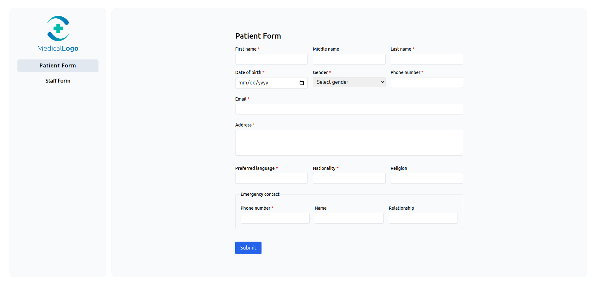
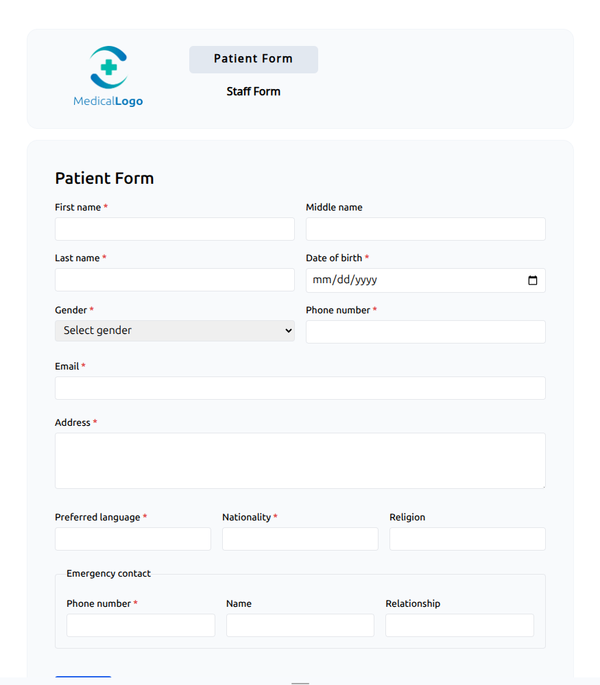
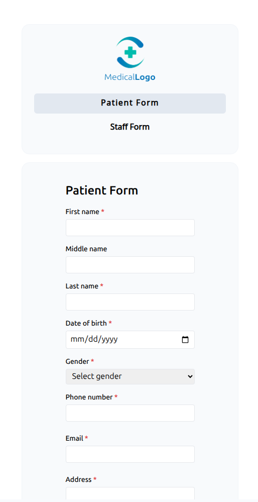
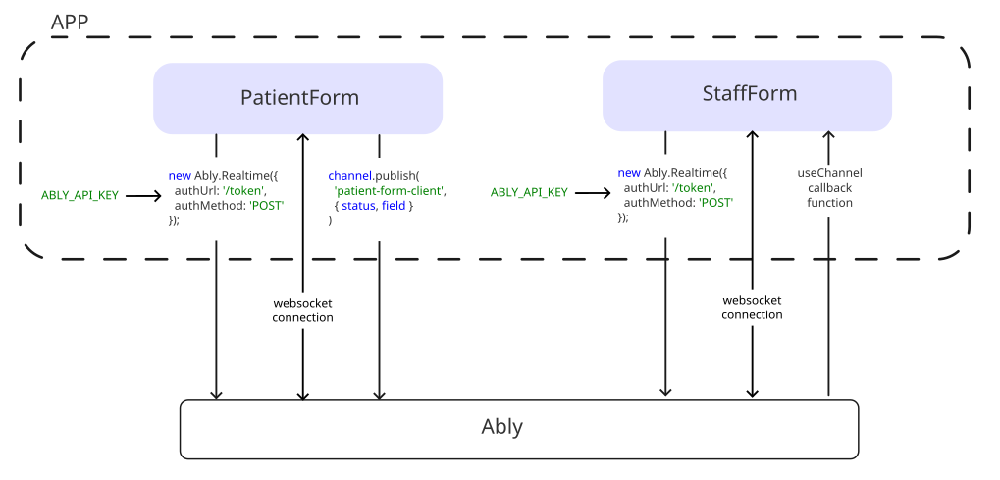

# Patient form

Simple patient form synchronized to staff view.

## Setup

1. Run `npm install`
1. Create `.env.local` file with `ABLY_API_KEY`. To get the API key:
  1.1. Go to [Ably](https://ably.com/)
  1.1. Sign Up
  1.1. Create a project
  1.1. Go to API Keys
  1.1. Create a new API Key
  1.1. Copy the key to `ABLY_API_KEY` value
1. Run `npm run dev`

## Project Structure

Folders:

- `components` - shared components
  - `Sidebar.tsx` - component for main menu and logo
  - `MenuItem.tsx` - component for main menu item
- `app`
  - `staff-form` - page with staff view
  - `token` - route for Ably connection
  - `page.tsx` - patient form (home page)

## Design

### Desktop

The patient form consists of three columns. The sidebar is located on the left. The main goal here is to fit the form in one screen to avoid vertical scroll.

### Tablet

To save space the sidebar is moved to the top of the page. Logo becomes smaller to save space. First six fields are divided into two columns to fit the page width. Last six fields are still in three columns, because they usualy have short text.

### Phone

The logo and the main menu are aligned vertically to fit the page width. All inputs are arranged in one column.

## Component Architecture

There are two main pages in the project:

1. PatientForm
1. StaffForm

### PatientForm

It's the root page of the project. The main purpose of the component is to get and send the patient form data via the Ably `patient-form-client` channel.

The patient form structure is described in `FormState` type.

The form has four states (`FillingState` type):

1. `pristine` - form wasn't touched
1. `filling` - the patient wrote something within last few seconds
1. `inactive` - the patient stopped writing for a few seconds. The amount of time before the state becomes `inactive` after the last input is stored in `INACTIVE_DELAY`
1. `submitted` - the patient pressed `submit` button and the form was successfully sent

### StaffForm

It's the page for staff view of the patient form. The main purpose of the component is to get the patient form data from the Ably `patient-form-client` channel, and show it to the staff in real time.

## Real-Time Synchronization Flow

First, both of the forms get access token via HTTP request to `https://rest.ably.io`. With this token they establish websocket connection and listen for changes.

The patient form send changes through channel `patient-form-updates` by calling `channel.publish()`.

The staff form subscribes to the changes with `useChannel`. Every change runs callback function.
